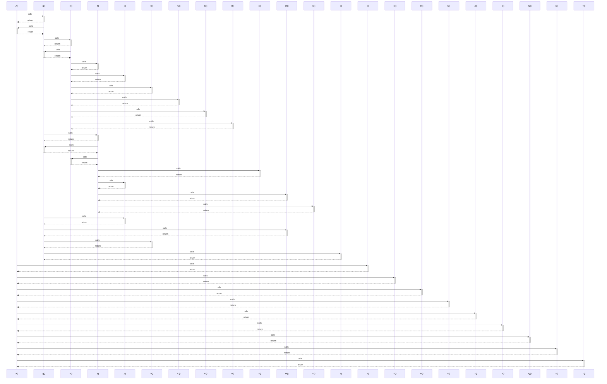

# A()

> God node · 11 connections · [C:\Users\hoppj\SynologyDrive\- Expertise\- Web\WordPress\Themes\Fruitful\Fruitful\js\flex_slider\modernizr.js](file:///C:/Users/hoppj/SynologyDrive/-%20Expertise/-%20Web/WordPress/Themes/Fruitful/Fruitful/js/flex_slider/modernizr.js#L2)

## Call Trace Diagram

## Connections by Relation

### calls
- [[g()]] `EXTRACTED`
- [[I()]] `INFERRED`
- [[K()]] `INFERRED`
- [[R()]] `INFERRED`
- [[U()]] `INFERRED`
- [[Z()]] `INFERRED`
- [[b()]] `INFERRED`
- [[Q()]] `INFERRED`
- [[S()]] `INFERRED`
- [[T()]] `INFERRED`

### contains
- [[modernizr.js]] `EXTRACTED`

---

*Part of the graphify knowledge wiki. See [[index]] to navigate.*