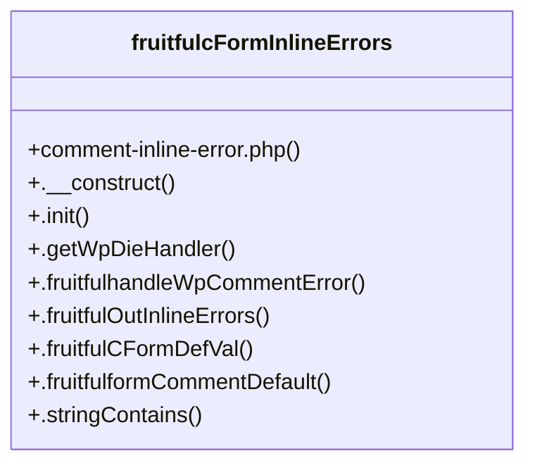

# Community 10

> 11 nodes · cohesion 0.20

## Key Concepts

- [fruitfulcFormInlineErrors](file:///C:/Users/hoppj/SynologyDrive/-%20Expertise/-%20Web/WordPress/Themes/Fruitful/Fruitful/inc/func/comment-inline-error.php#L13) (9 connections)
- [comment-inline-error.php](file:///C:/Users/hoppj/SynologyDrive/-%20Expertise/-%20Web/WordPress/Themes/Fruitful/Fruitful/inc/func/comment-inline-error.php#L1) (2 connections)
- [.fruitfulCFormDefVal()](file:///C:/Users/hoppj/SynologyDrive/-%20Expertise/-%20Web/WordPress/Themes/Fruitful/Fruitful/inc/func/comment-inline-error.php#L56) (2 connections)
- [.stringContains()](file:///C:/Users/hoppj/SynologyDrive/-%20Expertise/-%20Web/WordPress/Themes/Fruitful/Fruitful/inc/func/comment-inline-error.php#L84) (2 connections)
- [fruitful_setCustomSession()](file:///C:/Users/hoppj/SynologyDrive/-%20Expertise/-%20Web/WordPress/Themes/Fruitful/Fruitful/inc/func/comment-inline-error.php#L8) (1 connections)
- [.__construct()](file:///C:/Users/hoppj/SynologyDrive/-%20Expertise/-%20Web/WordPress/Themes/Fruitful/Fruitful/inc/func/comment-inline-error.php#L14) (1 connections)
- [.fruitfulformCommentDefault()](file:///C:/Users/hoppj/SynologyDrive/-%20Expertise/-%20Web/WordPress/Themes/Fruitful/Fruitful/inc/func/comment-inline-error.php#L74) (1 connections)
- [.fruitfulhandleWpCommentError()](file:///C:/Users/hoppj/SynologyDrive/-%20Expertise/-%20Web/WordPress/Themes/Fruitful/Fruitful/inc/func/comment-inline-error.php#L27) (1 connections)
- [.fruitfulOutInlineErrors()](file:///C:/Users/hoppj/SynologyDrive/-%20Expertise/-%20Web/WordPress/Themes/Fruitful/Fruitful/inc/func/comment-inline-error.php#L45) (1 connections)
- [.getWpDieHandler()](file:///C:/Users/hoppj/SynologyDrive/-%20Expertise/-%20Web/WordPress/Themes/Fruitful/Fruitful/inc/func/comment-inline-error.php#L26) (1 connections)
- [.init()](file:///C:/Users/hoppj/SynologyDrive/-%20Expertise/-%20Web/WordPress/Themes/Fruitful/Fruitful/inc/func/comment-inline-error.php#L18) (1 connections)

## Class Diagram

## Relationships

- No strong cross-community connections detected

## Source Files

- [C:\Users\hoppj\SynologyDrive\- Expertise\- Web\WordPress\Themes\Fruitful\Fruitful\inc\func\comment-inline-error.php](file:///C:/Users/hoppj/SynologyDrive/-%20Expertise/-%20Web/WordPress/Themes/Fruitful/Fruitful/inc/func/comment-inline-error.php)

## Audit Trail

- EXTRACTED: 22 (100%)
- INFERRED: 0 (0%)
- AMBIGUOUS: 0 (0%)

---

*Part of the graphify knowledge wiki. See [[index]] to navigate.*