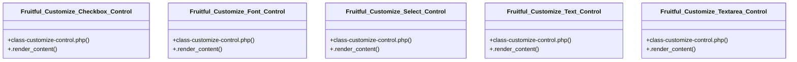

# Community 11

> 11 nodes · cohesion 0.18

## Key Concepts

- [class-customize-control.php](file:///C:/Users/hoppj/SynologyDrive/-%20Expertise/-%20Web/WordPress/Themes/Fruitful/Fruitful/inc/theme-options/customizer/class-customize-control.php#L1) (5 connections)
- [Fruitful_Customize_Checkbox_Control](file:///C:/Users/hoppj/SynologyDrive/-%20Expertise/-%20Web/WordPress/Themes/Fruitful/Fruitful/inc/theme-options/customizer/class-customize-control.php#L51) (2 connections)
- [.render_content()](file:///C:/Users/hoppj/SynologyDrive/-%20Expertise/-%20Web/WordPress/Themes/Fruitful/Fruitful/inc/theme-options/customizer/class-customize-control.php#L57) (2 connections)
- [Fruitful_Customize_Font_Control](file:///C:/Users/hoppj/SynologyDrive/-%20Expertise/-%20Web/WordPress/Themes/Fruitful/Fruitful/inc/theme-options/customizer/class-customize-control.php#L97) (2 connections)
- [.render_content()](file:///C:/Users/hoppj/SynologyDrive/-%20Expertise/-%20Web/WordPress/Themes/Fruitful/Fruitful/inc/theme-options/customizer/class-customize-control.php#L103) (2 connections)
- [Fruitful_Customize_Select_Control](file:///C:/Users/hoppj/SynologyDrive/-%20Expertise/-%20Web/WordPress/Themes/Fruitful/Fruitful/inc/theme-options/customizer/class-customize-control.php#L71) (2 connections)
- [.render_content()](file:///C:/Users/hoppj/SynologyDrive/-%20Expertise/-%20Web/WordPress/Themes/Fruitful/Fruitful/inc/theme-options/customizer/class-customize-control.php#L78) (2 connections)
- [Fruitful_Customize_Text_Control](file:///C:/Users/hoppj/SynologyDrive/-%20Expertise/-%20Web/WordPress/Themes/Fruitful/Fruitful/inc/theme-options/customizer/class-customize-control.php#L6) (2 connections)
- [Fruitful_Customize_Textarea_Control](file:///C:/Users/hoppj/SynologyDrive/-%20Expertise/-%20Web/WordPress/Themes/Fruitful/Fruitful/inc/theme-options/customizer/class-customize-control.php#L28) (2 connections)
- [.render_content()](file:///C:/Users/hoppj/SynologyDrive/-%20Expertise/-%20Web/WordPress/Themes/Fruitful/Fruitful/inc/theme-options/customizer/class-customize-control.php#L33) (2 connections)
- [.render_content()](file:///C:/Users/hoppj/SynologyDrive/-%20Expertise/-%20Web/WordPress/Themes/Fruitful/Fruitful/inc/theme-options/customizer/class-customize-control.php#L12) (1 connections)

## Class Diagram

## Relationships

- No strong cross-community connections detected

## Source Files

- [C:\Users\hoppj\SynologyDrive\- Expertise\- Web\WordPress\Themes\Fruitful\Fruitful\inc\theme-options\customizer\class-customize-control.php](file:///C:/Users/hoppj/SynologyDrive/-%20Expertise/-%20Web/WordPress/Themes/Fruitful/Fruitful/inc/theme-options/customizer/class-customize-control.php)

## Audit Trail

- EXTRACTED: 20 (83%)
- INFERRED: 4 (17%)
- AMBIGUOUS: 0 (0%)

---

*Part of the graphify knowledge wiki. See [[index]] to navigate.*