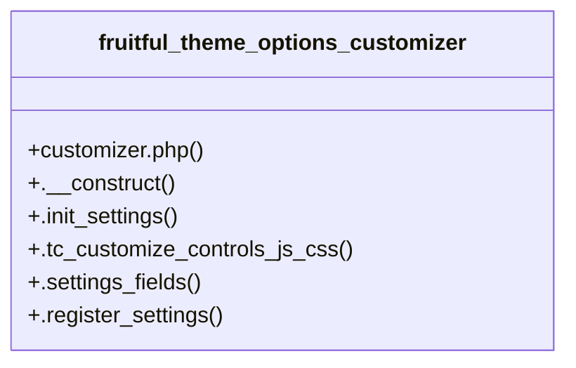

# Community 12

> 7 nodes · cohesion 0.33

## Key Concepts

- [fruitful_theme_options_customizer](file:///C:/Users/hoppj/SynologyDrive/-%20Expertise/-%20Web/WordPress/Themes/Fruitful/Fruitful/inc/theme-options/customizer/customizer.php#L2) (6 connections)
- [.init_settings()](file:///C:/Users/hoppj/SynologyDrive/-%20Expertise/-%20Web/WordPress/Themes/Fruitful/Fruitful/inc/theme-options/customizer/customizer.php#L12) (2 connections)
- [.register_settings()](file:///C:/Users/hoppj/SynologyDrive/-%20Expertise/-%20Web/WordPress/Themes/Fruitful/Fruitful/inc/theme-options/customizer/customizer.php#L32) (2 connections)
- [.settings_fields()](file:///C:/Users/hoppj/SynologyDrive/-%20Expertise/-%20Web/WordPress/Themes/Fruitful/Fruitful/inc/theme-options/customizer/customizer.php#L27) (2 connections)
- [customizer.php](file:///C:/Users/hoppj/SynologyDrive/-%20Expertise/-%20Web/WordPress/Themes/Fruitful/Fruitful/inc/theme-options/customizer/customizer.php#L1) (1 connections)
- [.__construct()](file:///C:/Users/hoppj/SynologyDrive/-%20Expertise/-%20Web/WordPress/Themes/Fruitful/Fruitful/inc/theme-options/customizer/customizer.php#L6) (1 connections)
- [.tc_customize_controls_js_css()](file:///C:/Users/hoppj/SynologyDrive/-%20Expertise/-%20Web/WordPress/Themes/Fruitful/Fruitful/inc/theme-options/customizer/customizer.php#L18) (1 connections)

## Class Diagram

## Relationships

- No strong cross-community connections detected

## Source Files

- [C:\Users\hoppj\SynologyDrive\- Expertise\- Web\WordPress\Themes\Fruitful\Fruitful\inc\theme-options\customizer\customizer.php](file:///C:/Users/hoppj/SynologyDrive/-%20Expertise/-%20Web/WordPress/Themes/Fruitful/Fruitful/inc/theme-options/customizer/customizer.php)

## Audit Trail

- EXTRACTED: 14 (93%)
- INFERRED: 1 (7%)
- AMBIGUOUS: 0 (0%)

---

*Part of the graphify knowledge wiki. See [[index]] to navigate.*