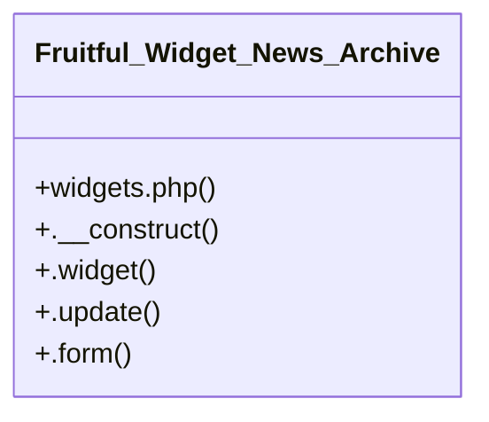

# Community 14

> 6 nodes · cohesion 0.33

## Key Concepts

- [Fruitful_Widget_News_Archive](file:///C:/Users/hoppj/SynologyDrive/-%20Expertise/-%20Web/WordPress/Themes/Fruitful/Fruitful/inc/widgets.php#L9) (5 connections)
- [widgets.php](file:///C:/Users/hoppj/SynologyDrive/-%20Expertise/-%20Web/WordPress/Themes/Fruitful/Fruitful/inc/widgets.php#L1) (1 connections)
- [.__construct()](file:///C:/Users/hoppj/SynologyDrive/-%20Expertise/-%20Web/WordPress/Themes/Fruitful/Fruitful/inc/widgets.php#L15) (1 connections)
- [.form()](file:///C:/Users/hoppj/SynologyDrive/-%20Expertise/-%20Web/WordPress/Themes/Fruitful/Fruitful/inc/widgets.php#L117) (1 connections)
- [.update()](file:///C:/Users/hoppj/SynologyDrive/-%20Expertise/-%20Web/WordPress/Themes/Fruitful/Fruitful/inc/widgets.php#L101) (1 connections)
- [.widget()](file:///C:/Users/hoppj/SynologyDrive/-%20Expertise/-%20Web/WordPress/Themes/Fruitful/Fruitful/inc/widgets.php#L31) (1 connections)

## Class Diagram

## Relationships

- No strong cross-community connections detected

## Source Files

- [C:\Users\hoppj\SynologyDrive\- Expertise\- Web\WordPress\Themes\Fruitful\Fruitful\inc\widgets.php](file:///C:/Users/hoppj/SynologyDrive/-%20Expertise/-%20Web/WordPress/Themes/Fruitful/Fruitful/inc/widgets.php)

## Audit Trail

- EXTRACTED: 10 (100%)
- INFERRED: 0 (0%)
- AMBIGUOUS: 0 (0%)

---

*Part of the graphify knowledge wiki. See [[index]] to navigate.*