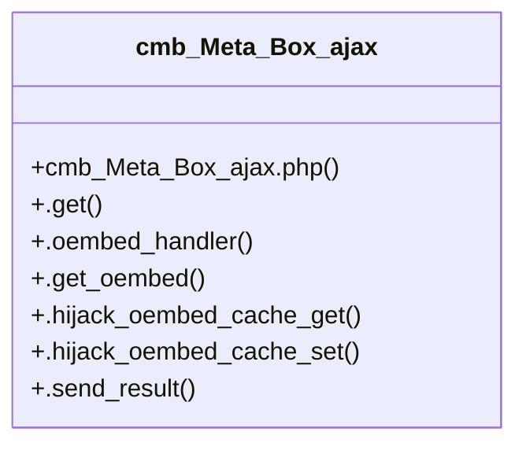

# Community 3

> 67 nodes · cohesion 0.04

## Key Concepts

- [select2.js](file:///C:/Users/hoppj/SynologyDrive/-%20Expertise/-%20Web/WordPress/Themes/Fruitful/Fruitful/inc/metaboxes/js/select2/select2.js#L1) (47 connections)
- [.get()](file:///C:/Users/hoppj/SynologyDrive/-%20Expertise/-%20Web/WordPress/Themes/Fruitful/Fruitful/inc/metaboxes/helpers/cmb_Meta_Box_ajax.php#L24) (20 connections)
- [select2.min.js](file:///C:/Users/hoppj/SynologyDrive/-%20Expertise/-%20Web/WordPress/Themes/Fruitful/Fruitful/inc/metaboxes/js/select2/select2.min.js#L1) (12 connections)
- [cmb_Meta_Box_ajax](file:///C:/Users/hoppj/SynologyDrive/-%20Expertise/-%20Web/WordPress/Themes/Fruitful/Fruitful/inc/metaboxes/helpers/cmb_Meta_Box_ajax.php#L9) (8 connections)
- [e()](file:///C:/Users/hoppj/SynologyDrive/-%20Expertise/-%20Web/WordPress/Themes/Fruitful/Fruitful/inc/metaboxes/js/select2/select2.min.js#L1) (6 connections)
- [b()](file:///C:/Users/hoppj/SynologyDrive/-%20Expertise/-%20Web/WordPress/Themes/Fruitful/Fruitful/inc/metaboxes/js/select2/select2.min.js#L1) (5 connections)
- [c()](file:///C:/Users/hoppj/SynologyDrive/-%20Expertise/-%20Web/WordPress/Themes/Fruitful/Fruitful/inc/metaboxes/js/select2/select2.min.js#L1) (5 connections)
- [d()](file:///C:/Users/hoppj/SynologyDrive/-%20Expertise/-%20Web/WordPress/Themes/Fruitful/Fruitful/inc/metaboxes/js/select2/select2.min.js#L1) (5 connections)
- [a()](file:///C:/Users/hoppj/SynologyDrive/-%20Expertise/-%20Web/WordPress/Themes/Fruitful/Fruitful/inc/metaboxes/js/select2/select2.min.js#L2) (4 connections)
- [createAndSelect()](file:///C:/Users/hoppj/SynologyDrive/-%20Expertise/-%20Web/WordPress/Themes/Fruitful/Fruitful/inc/metaboxes/js/select2/select2.js#L3664) (3 connections)
- [f()](file:///C:/Users/hoppj/SynologyDrive/-%20Expertise/-%20Web/WordPress/Themes/Fruitful/Fruitful/inc/metaboxes/js/select2/select2.min.js#L1) (3 connections)
- [Tags()](file:///C:/Users/hoppj/SynologyDrive/-%20Expertise/-%20Web/WordPress/Themes/Fruitful/Fruitful/inc/metaboxes/js/select2/select2.js#L3515) (3 connections)
- [.hijack_oembed_cache_get()](file:///C:/Users/hoppj/SynologyDrive/-%20Expertise/-%20Web/WordPress/Themes/Fruitful/Fruitful/inc/metaboxes/helpers/cmb_Meta_Box_ajax.php#L148) (2 connections)
- [.hijack_oembed_cache_set()](file:///C:/Users/hoppj/SynologyDrive/-%20Expertise/-%20Web/WordPress/Themes/Fruitful/Fruitful/inc/metaboxes/helpers/cmb_Meta_Box_ajax.php#L172) (2 connections)
- [AjaxAdapter()](file:///C:/Users/hoppj/SynologyDrive/-%20Expertise/-%20Web/WordPress/Themes/Fruitful/Fruitful/inc/metaboxes/js/select2/select2.js#L3407) (2 connections)
- [ArrayAdapter()](file:///C:/Users/hoppj/SynologyDrive/-%20Expertise/-%20Web/WordPress/Themes/Fruitful/Fruitful/inc/metaboxes/js/select2/select2.js#L3327) (2 connections)
- [AttachBody()](file:///C:/Users/hoppj/SynologyDrive/-%20Expertise/-%20Web/WordPress/Themes/Fruitful/Fruitful/inc/metaboxes/js/select2/select2.js#L4135) (2 connections)
- [callDep()](file:///C:/Users/hoppj/SynologyDrive/-%20Expertise/-%20Web/WordPress/Themes/Fruitful/Fruitful/inc/metaboxes/js/select2/select2.js#L220) (2 connections)
- [hasProp()](file:///C:/Users/hoppj/SynologyDrive/-%20Expertise/-%20Web/WordPress/Themes/Fruitful/Fruitful/inc/metaboxes/js/select2/select2.js#L67) (2 connections)
- [HidePlaceholder()](file:///C:/Users/hoppj/SynologyDrive/-%20Expertise/-%20Web/WordPress/Themes/Fruitful/Fruitful/inc/metaboxes/js/select2/select2.js#L4001) (2 connections)
- [makeNormalize()](file:///C:/Users/hoppj/SynologyDrive/-%20Expertise/-%20Web/WordPress/Themes/Fruitful/Fruitful/inc/metaboxes/js/select2/select2.js#L208) (2 connections)
- [matcher()](file:///C:/Users/hoppj/SynologyDrive/-%20Expertise/-%20Web/WordPress/Themes/Fruitful/Fruitful/inc/metaboxes/js/select2/select2.js#L4834) (2 connections)
- [MaximumInputLength()](file:///C:/Users/hoppj/SynologyDrive/-%20Expertise/-%20Web/WordPress/Themes/Fruitful/Fruitful/inc/metaboxes/js/select2/select2.js#L3792) (2 connections)
- [MaximumSelectionLength()](file:///C:/Users/hoppj/SynologyDrive/-%20Expertise/-%20Web/WordPress/Themes/Fruitful/Fruitful/inc/metaboxes/js/select2/select2.js#L3824) (2 connections)
- [h()](file:///C:/Users/hoppj/SynologyDrive/-%20Expertise/-%20Web/WordPress/Themes/Fruitful/Fruitful/inc/metaboxes/js/select2/select2.min.js#L1) (2 connections)
- *... and 42 more nodes in this community*

## Class Diagram

## Relationships

- No strong cross-community connections detected

## Source Files

- [C:\Users\hoppj\SynologyDrive\- Expertise\- Web\WordPress\Themes\Fruitful\Fruitful\inc\metaboxes\helpers\cmb_Meta_Box_ajax.php](file:///C:/Users/hoppj/SynologyDrive/-%20Expertise/-%20Web/WordPress/Themes/Fruitful/Fruitful/inc/metaboxes/helpers/cmb_Meta_Box_ajax.php)
- [C:\Users\hoppj\SynologyDrive\- Expertise\- Web\WordPress\Themes\Fruitful\Fruitful\inc\metaboxes\js\select2\select2.js](file:///C:/Users/hoppj/SynologyDrive/-%20Expertise/-%20Web/WordPress/Themes/Fruitful/Fruitful/inc/metaboxes/js/select2/select2.js)
- [C:\Users\hoppj\SynologyDrive\- Expertise\- Web\WordPress\Themes\Fruitful\Fruitful\inc\metaboxes\js\select2\select2.min.js](file:///C:/Users/hoppj/SynologyDrive/-%20Expertise/-%20Web/WordPress/Themes/Fruitful/Fruitful/inc/metaboxes/js/select2/select2.min.js)

## Audit Trail

- EXTRACTED: 154 (78%)
- INFERRED: 44 (22%)
- AMBIGUOUS: 0 (0%)

---

*Part of the graphify knowledge wiki. See [[index]] to navigate.*