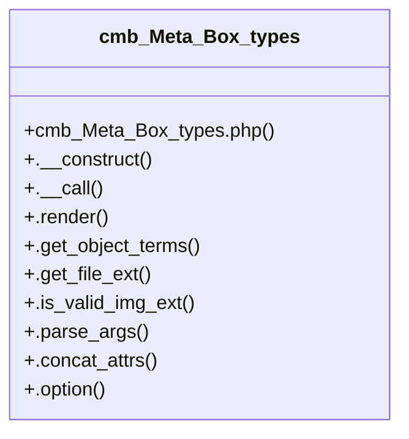

# Community 4

> 53 nodes · cohesion 0.12

## Key Concepts

- [cmb_Meta_Box_types](file:///C:/Users/hoppj/SynologyDrive/-%20Expertise/-%20Web/WordPress/Themes/Fruitful/Fruitful/inc/metaboxes/helpers/cmb_Meta_Box_types.php#L12) (53 connections)
- [.escaped_value()](file:///C:/Users/hoppj/SynologyDrive/-%20Expertise/-%20Web/WordPress/Themes/Fruitful/Fruitful/inc/metaboxes/helpers/cmb_Meta_Box_field.php#L296) (25 connections)
- [.input()](file:///C:/Users/hoppj/SynologyDrive/-%20Expertise/-%20Web/WordPress/Themes/Fruitful/Fruitful/inc/metaboxes/helpers/cmb_Meta_Box_types.php#L372) (23 connections)
- [._desc()](file:///C:/Users/hoppj/SynologyDrive/-%20Expertise/-%20Web/WordPress/Themes/Fruitful/Fruitful/inc/metaboxes/helpers/cmb_Meta_Box_types.php#L323) (18 connections)
- [._id()](file:///C:/Users/hoppj/SynologyDrive/-%20Expertise/-%20Web/WordPress/Themes/Fruitful/Fruitful/inc/metaboxes/helpers/cmb_Meta_Box_types.php#L362) (16 connections)
- [._name()](file:///C:/Users/hoppj/SynologyDrive/-%20Expertise/-%20Web/WordPress/Themes/Fruitful/Fruitful/inc/metaboxes/helpers/cmb_Meta_Box_types.php#L341) (12 connections)
- [.list_input()](file:///C:/Users/hoppj/SynologyDrive/-%20Expertise/-%20Web/WordPress/Themes/Fruitful/Fruitful/inc/metaboxes/helpers/cmb_Meta_Box_types.php#L207) (10 connections)
- [.textarea()](file:///C:/Users/hoppj/SynologyDrive/-%20Expertise/-%20Web/WordPress/Themes/Fruitful/Fruitful/inc/metaboxes/helpers/cmb_Meta_Box_types.php#L392) (10 connections)
- [.parse_args()](file:///C:/Users/hoppj/SynologyDrive/-%20Expertise/-%20Web/WordPress/Themes/Fruitful/Fruitful/inc/metaboxes/helpers/cmb_Meta_Box_types.php#L127) (9 connections)
- [.select()](file:///C:/Users/hoppj/SynologyDrive/-%20Expertise/-%20Web/WordPress/Themes/Fruitful/Fruitful/inc/metaboxes/helpers/cmb_Meta_Box_types.php#L552) (9 connections)
- [.text_datetime_timestamp()](file:///C:/Users/hoppj/SynologyDrive/-%20Expertise/-%20Web/WordPress/Themes/Fruitful/Fruitful/inc/metaboxes/helpers/cmb_Meta_Box_types.php#L468) (9 connections)
- [.file()](file:///C:/Users/hoppj/SynologyDrive/-%20Expertise/-%20Web/WordPress/Themes/Fruitful/Fruitful/inc/metaboxes/helpers/cmb_Meta_Box_types.php#L734) (8 connections)
- [.radio()](file:///C:/Users/hoppj/SynologyDrive/-%20Expertise/-%20Web/WordPress/Themes/Fruitful/Fruitful/inc/metaboxes/helpers/cmb_Meta_Box_types.php#L581) (8 connections)
- [.concat_options()](file:///C:/Users/hoppj/SynologyDrive/-%20Expertise/-%20Web/WordPress/Themes/Fruitful/Fruitful/inc/metaboxes/helpers/cmb_Meta_Box_types.php#L166) (7 connections)
- [.file_list()](file:///C:/Users/hoppj/SynologyDrive/-%20Expertise/-%20Web/WordPress/Themes/Fruitful/Fruitful/inc/metaboxes/helpers/cmb_Meta_Box_types.php#L679) (7 connections)
- [.taxonomy_multicheck()](file:///C:/Users/hoppj/SynologyDrive/-%20Expertise/-%20Web/WordPress/Themes/Fruitful/Fruitful/inc/metaboxes/helpers/cmb_Meta_Box_types.php#L642) (7 connections)
- [.select_timezone()](file:///C:/Users/hoppj/SynologyDrive/-%20Expertise/-%20Web/WordPress/Themes/Fruitful/Fruitful/inc/metaboxes/helpers/cmb_Meta_Box_types.php#L519) (6 connections)
- [._subname()](file:///C:/Users/hoppj/SynologyDrive/-%20Expertise/-%20Web/WordPress/Themes/Fruitful/Fruitful/inc/metaboxes/helpers/cmb_Meta_Box_types.php#L352) (6 connections)
- [.taxonomy_radio()](file:///C:/Users/hoppj/SynologyDrive/-%20Expertise/-%20Web/WordPress/Themes/Fruitful/Fruitful/inc/metaboxes/helpers/cmb_Meta_Box_types.php#L612) (6 connections)
- [.text_datetime_timestamp_timezone()](file:///C:/Users/hoppj/SynologyDrive/-%20Expertise/-%20Web/WordPress/Themes/Fruitful/Fruitful/inc/metaboxes/helpers/cmb_Meta_Box_types.php#L500) (6 connections)
- [.wysiwyg()](file:///C:/Users/hoppj/SynologyDrive/-%20Expertise/-%20Web/WordPress/Themes/Fruitful/Fruitful/inc/metaboxes/helpers/cmb_Meta_Box_types.php#L450) (6 connections)
- [.checkbox()](file:///C:/Users/hoppj/SynologyDrive/-%20Expertise/-%20Web/WordPress/Themes/Fruitful/Fruitful/inc/metaboxes/helpers/cmb_Meta_Box_types.php#L603) (5 connections)
- [.concat_attrs()](file:///C:/Users/hoppj/SynologyDrive/-%20Expertise/-%20Web/WordPress/Themes/Fruitful/Fruitful/inc/metaboxes/helpers/cmb_Meta_Box_types.php#L138) (5 connections)
- [.get_object_terms()](file:///C:/Users/hoppj/SynologyDrive/-%20Expertise/-%20Web/WordPress/Themes/Fruitful/Fruitful/inc/metaboxes/helpers/cmb_Meta_Box_types.php#L68) (5 connections)
- [.multicheck()](file:///C:/Users/hoppj/SynologyDrive/-%20Expertise/-%20Web/WordPress/Themes/Fruitful/Fruitful/inc/metaboxes/helpers/cmb_Meta_Box_types.php#L595) (5 connections)
- *... and 28 more nodes in this community*

## Class Diagram

## Relationships

- No strong cross-community connections detected

## Source Files

- [C:\Users\hoppj\SynologyDrive\- Expertise\- Web\WordPress\Themes\Fruitful\Fruitful\inc\metaboxes\helpers\cmb_Meta_Box_field.php](file:///C:/Users/hoppj/SynologyDrive/-%20Expertise/-%20Web/WordPress/Themes/Fruitful/Fruitful/inc/metaboxes/helpers/cmb_Meta_Box_field.php)
- [C:\Users\hoppj\SynologyDrive\- Expertise\- Web\WordPress\Themes\Fruitful\Fruitful\inc\metaboxes\helpers\cmb_Meta_Box_types.php](file:///C:/Users/hoppj/SynologyDrive/-%20Expertise/-%20Web/WordPress/Themes/Fruitful/Fruitful/inc/metaboxes/helpers/cmb_Meta_Box_types.php)

## Audit Trail

- EXTRACTED: 299 (82%)
- INFERRED: 65 (18%)
- AMBIGUOUS: 0 (0%)

---

*Part of the graphify knowledge wiki. See [[index]] to navigate.*