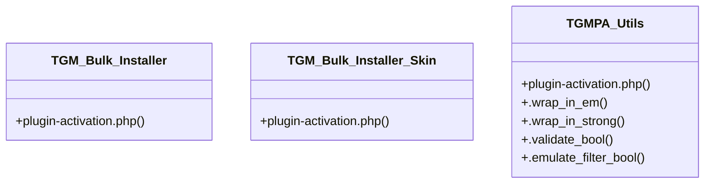

# Community 9

> 13 nodes · cohesion 0.15

## Key Concepts

- [plugin-activation.php](file:///C:/Users/hoppj/SynologyDrive/-%20Expertise/-%20Web/WordPress/Themes/Fruitful/Fruitful/inc/func/plugin-activation.php#L1) (8 connections)
- [TGMPA_Utils](file:///C:/Users/hoppj/SynologyDrive/-%20Expertise/-%20Web/WordPress/Themes/Fruitful/Fruitful/inc/func/plugin-activation.php#L3498) (6 connections)
- [load_tgm_plugin_activation()](file:///C:/Users/hoppj/SynologyDrive/-%20Expertise/-%20Web/WordPress/Themes/Fruitful/Fruitful/inc/func/plugin-activation.php#L1897) (2 connections)
- [tgmpa()](file:///C:/Users/hoppj/SynologyDrive/-%20Expertise/-%20Web/WordPress/Themes/Fruitful/Fruitful/inc/func/plugin-activation.php#L1919) (2 connections)
- [fruitful_register_required_plugins()](file:///C:/Users/hoppj/SynologyDrive/-%20Expertise/-%20Web/WordPress/Themes/Fruitful/Fruitful/inc/func/plugins-included.php#L9) (2 connections)
- [plugins-included.php](file:///C:/Users/hoppj/SynologyDrive/-%20Expertise/-%20Web/WordPress/Themes/Fruitful/Fruitful/inc/func/plugins-included.php#L1) (1 connections)
- [TGM_Bulk_Installer](file:///C:/Users/hoppj/SynologyDrive/-%20Expertise/-%20Web/WordPress/Themes/Fruitful/Fruitful/inc/func/plugin-activation.php#L2894) (1 connections)
- [TGM_Bulk_Installer_Skin](file:///C:/Users/hoppj/SynologyDrive/-%20Expertise/-%20Web/WordPress/Themes/Fruitful/Fruitful/inc/func/plugin-activation.php#L2902) (1 connections)
- [tgmpa_load_bulk_installer()](file:///C:/Users/hoppj/SynologyDrive/-%20Expertise/-%20Web/WordPress/Themes/Fruitful/Fruitful/inc/func/plugin-activation.php#L2921) (1 connections)
- [.emulate_filter_bool()](file:///C:/Users/hoppj/SynologyDrive/-%20Expertise/-%20Web/WordPress/Themes/Fruitful/Fruitful/inc/func/plugin-activation.php#L3572) (1 connections)
- [.validate_bool()](file:///C:/Users/hoppj/SynologyDrive/-%20Expertise/-%20Web/WordPress/Themes/Fruitful/Fruitful/inc/func/plugin-activation.php#L3550) (1 connections)
- [.wrap_in_em()](file:///C:/Users/hoppj/SynologyDrive/-%20Expertise/-%20Web/WordPress/Themes/Fruitful/Fruitful/inc/func/plugin-activation.php#L3522) (1 connections)
- [.wrap_in_strong()](file:///C:/Users/hoppj/SynologyDrive/-%20Expertise/-%20Web/WordPress/Themes/Fruitful/Fruitful/inc/func/plugin-activation.php#L3536) (1 connections)

## Class Diagram

## Relationships

- No strong cross-community connections detected

## Source Files

- [C:\Users\hoppj\SynologyDrive\- Expertise\- Web\WordPress\Themes\Fruitful\Fruitful\inc\func\plugin-activation.php](file:///C:/Users/hoppj/SynologyDrive/-%20Expertise/-%20Web/WordPress/Themes/Fruitful/Fruitful/inc/func/plugin-activation.php)
- [C:\Users\hoppj\SynologyDrive\- Expertise\- Web\WordPress\Themes\Fruitful\Fruitful\inc\func\plugins-included.php](file:///C:/Users/hoppj/SynologyDrive/-%20Expertise/-%20Web/WordPress/Themes/Fruitful/Fruitful/inc/func/plugins-included.php)

## Audit Trail

- EXTRACTED: 26 (93%)
- INFERRED: 2 (7%)
- AMBIGUOUS: 0 (0%)

---

*Part of the graphify knowledge wiki. See [[index]] to navigate.*