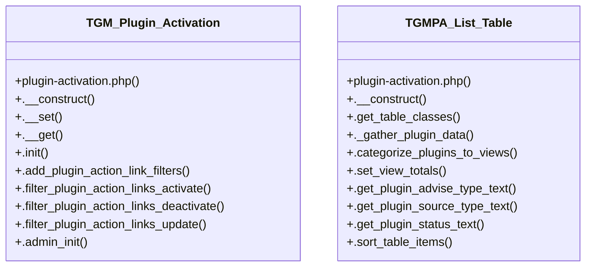

# Plugin Activation

> 79 nodes · cohesion 0.06

## Key Concepts

- [TGM_Plugin_Activation](file:///C:/Users/hoppj/SynologyDrive/-%20Expertise/-%20Web/WordPress/Themes/Fruitful/Fruitful/inc/func/plugin-activation.php#L61) (53 connections)
- [TGMPA_List_Table](file:///C:/Users/hoppj/SynologyDrive/-%20Expertise/-%20Web/WordPress/Themes/Fruitful/Fruitful/inc/func/plugin-activation.php#L1976) (27 connections)
- [._gather_plugin_data()](file:///C:/Users/hoppj/SynologyDrive/-%20Expertise/-%20Web/WordPress/Themes/Fruitful/Fruitful/inc/func/plugin-activation.php#L2052) (13 connections)
- [.do_plugin_install()](file:///C:/Users/hoppj/SynologyDrive/-%20Expertise/-%20Web/WordPress/Themes/Fruitful/Fruitful/inc/func/plugin-activation.php#L701) (12 connections)
- [.process_bulk_actions()](file:///C:/Users/hoppj/SynologyDrive/-%20Expertise/-%20Web/WordPress/Themes/Fruitful/Fruitful/inc/func/plugin-activation.php#L2619) (12 connections)
- [.can_plugin_activate()](file:///C:/Users/hoppj/SynologyDrive/-%20Expertise/-%20Web/WordPress/Themes/Fruitful/Fruitful/inc/func/plugin-activation.php#L1703) (10 connections)
- [.notices()](file:///C:/Users/hoppj/SynologyDrive/-%20Expertise/-%20Web/WordPress/Themes/Fruitful/Fruitful/inc/func/plugin-activation.php#L1014) (10 connections)
- [.does_plugin_have_update()](file:///C:/Users/hoppj/SynologyDrive/-%20Expertise/-%20Web/WordPress/Themes/Fruitful/Fruitful/inc/func/plugin-activation.php#L1749) (9 connections)
- [.does_plugin_require_update()](file:///C:/Users/hoppj/SynologyDrive/-%20Expertise/-%20Web/WordPress/Themes/Fruitful/Fruitful/inc/func/plugin-activation.php#L1734) (9 connections)
- [.is_plugin_active()](file:///C:/Users/hoppj/SynologyDrive/-%20Expertise/-%20Web/WordPress/Themes/Fruitful/Fruitful/inc/func/plugin-activation.php#L1665) (9 connections)
- [.is_plugin_installed()](file:///C:/Users/hoppj/SynologyDrive/-%20Expertise/-%20Web/WordPress/Themes/Fruitful/Fruitful/inc/func/plugin-activation.php#L1651) (9 connections)
- [.get_row_actions()](file:///C:/Users/hoppj/SynologyDrive/-%20Expertise/-%20Web/WordPress/Themes/Fruitful/Fruitful/inc/func/plugin-activation.php#L2477) (7 connections)
- [.activate_single_plugin()](file:///C:/Users/hoppj/SynologyDrive/-%20Expertise/-%20Web/WordPress/Themes/Fruitful/Fruitful/inc/func/plugin-activation.php#L948) (6 connections)
- [.get_tgmpa_url()](file:///C:/Users/hoppj/SynologyDrive/-%20Expertise/-%20Web/WordPress/Themes/Fruitful/Fruitful/inc/func/plugin-activation.php#L1585) (6 connections)
- [.categorize_plugins_to_views()](file:///C:/Users/hoppj/SynologyDrive/-%20Expertise/-%20Web/WordPress/Themes/Fruitful/Fruitful/inc/func/plugin-activation.php#L2104) (6 connections)
- [.get_plugin_status_text()](file:///C:/Users/hoppj/SynologyDrive/-%20Expertise/-%20Web/WordPress/Themes/Fruitful/Fruitful/inc/func/plugin-activation.php#L2199) (6 connections)
- [.prepare_items()](file:///C:/Users/hoppj/SynologyDrive/-%20Expertise/-%20Web/WordPress/Themes/Fruitful/Fruitful/inc/func/plugin-activation.php#L2851) (6 connections)
- [.get_tgmpa_status_url()](file:///C:/Users/hoppj/SynologyDrive/-%20Expertise/-%20Web/WordPress/Themes/Fruitful/Fruitful/inc/func/plugin-activation.php#L1615) (5 connections)
- [.is_tgmpa_complete()](file:///C:/Users/hoppj/SynologyDrive/-%20Expertise/-%20Web/WordPress/Themes/Fruitful/Fruitful/inc/func/plugin-activation.php#L1631) (5 connections)
- [.is_tgmpa_page()](file:///C:/Users/hoppj/SynologyDrive/-%20Expertise/-%20Web/WordPress/Themes/Fruitful/Fruitful/inc/func/plugin-activation.php#L1571) (5 connections)
- [.register()](file:///C:/Users/hoppj/SynologyDrive/-%20Expertise/-%20Web/WordPress/Themes/Fruitful/Fruitful/inc/func/plugin-activation.php#L1226) (5 connections)
- [.can_plugin_update()](file:///C:/Users/hoppj/SynologyDrive/-%20Expertise/-%20Web/WordPress/Themes/Fruitful/Fruitful/inc/func/plugin-activation.php#L1678) (4 connections)
- [.get_download_url()](file:///C:/Users/hoppj/SynologyDrive/-%20Expertise/-%20Web/WordPress/Themes/Fruitful/Fruitful/inc/func/plugin-activation.php#L1460) (4 connections)
- [.get_installed_version()](file:///C:/Users/hoppj/SynologyDrive/-%20Expertise/-%20Web/WordPress/Themes/Fruitful/Fruitful/inc/func/plugin-activation.php#L1716) (4 connections)
- [._get_plugin_basename_from_slug()](file:///C:/Users/hoppj/SynologyDrive/-%20Expertise/-%20Web/WordPress/Themes/Fruitful/Fruitful/inc/func/plugin-activation.php#L1418) (4 connections)
- *... and 54 more nodes in this community*

## Class Diagram

## Relationships

- No strong cross-community connections detected

## Source Files

- [C:\Users\hoppj\SynologyDrive\- Expertise\- Web\WordPress\Themes\Fruitful\Fruitful\inc\func\plugin-activation.php](file:///C:/Users/hoppj/SynologyDrive/-%20Expertise/-%20Web/WordPress/Themes/Fruitful/Fruitful/inc/func/plugin-activation.php)

## Audit Trail

- EXTRACTED: 350 (99%)
- INFERRED: 2 (1%)
- AMBIGUOUS: 0 (0%)

---

*Part of the graphify knowledge wiki. See [[index]] to navigate.*