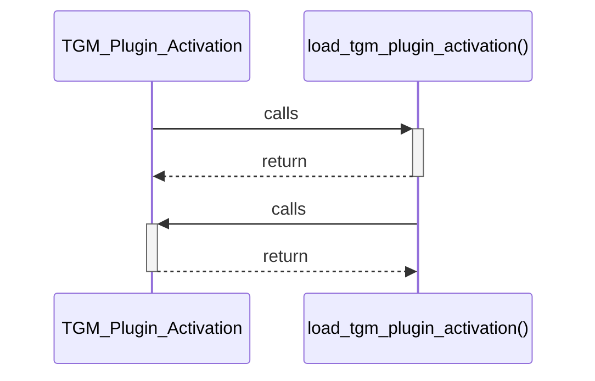

# TGM_Plugin_Activation

> God node · 53 connections · [C:\Users\hoppj\SynologyDrive\- Expertise\- Web\WordPress\Themes\Fruitful\Fruitful\inc\func\plugin-activation.php](file:///C:/Users/hoppj/SynologyDrive/-%20Expertise/-%20Web/WordPress/Themes/Fruitful/Fruitful/inc/func/plugin-activation.php#L61)

## Call Trace Diagram

## Connections by Relation

### calls
- [[load_tgm_plugin_activation()]] `EXTRACTED`

### contains
- [[plugin-activation.php]] `EXTRACTED`

### method
- [[.do_plugin_install()]] `EXTRACTED`
- [[.notices()]] `EXTRACTED`
- [[.can_plugin_activate()]] `EXTRACTED`
- [[.is_plugin_installed()]] `EXTRACTED`
- [[.is_plugin_active()]] `EXTRACTED`
- [[.does_plugin_require_update()]] `EXTRACTED`
- [[.does_plugin_have_update()]] `EXTRACTED`
- [[.activate_single_plugin()]] `EXTRACTED`
- [[.get_tgmpa_url()]] `EXTRACTED`
- [[.register()]] `EXTRACTED`
- [[.is_tgmpa_page()]] `EXTRACTED`
- [[.get_tgmpa_status_url()]] `EXTRACTED`
- [[.is_tgmpa_complete()]] `EXTRACTED`
- [[.install_plugins_page()]] `EXTRACTED`
- [[.sanitize_key()]] `EXTRACTED`
- [[._get_plugin_basename_from_slug()]] `EXTRACTED`
- [[.get_download_url()]] `EXTRACTED`
- [[.get_plugins_api()]] `EXTRACTED`
- [[.can_plugin_update()]] `EXTRACTED`
- [[.get_installed_version()]] `EXTRACTED`

---

*Part of the graphify knowledge wiki. See [[index]] to navigate.*