# cmb_Meta_Box

> God node · 54 connections · [C:\Users\hoppj\SynologyDrive\- Expertise\- Web\WordPress\Themes\Fruitful\Fruitful\inc\metaboxes\init.php](file:///C:/Users/hoppj/SynologyDrive/-%20Expertise/-%20Web/WordPress/Themes/Fruitful/Fruitful/inc/metaboxes/init.php#L51)

## Call Trace Diagram

```mermaid
sequenceDiagram
    participant P0 as cmb_Meta_Box
    participant P1 as .get_data()
    participant P2 as .args()
    participant P3 as .escaped_value()
    participant P4 as ._desc()
    participant P5 as ._id()
    participant P6 as .id()
    participant P7 as ._name()
    participant P8 as ._save_file_id()
    participant P9 as .text_datetime_timestamp()
    participant P10 as .file()
    participant P11 as .concat_options()
    participant P12 as .taxonomy_multicheck()
    participant P13 as .file_list()
    participant P14 as .data_args()
    participant P15 as .render_field()
    participant P16 as .render_group_row()
    participant P17 as ._subname()
    participant P18 as .wysiwyg()
    participant P19 as .select_timezone()
    participant P20 as .taxonomy_radio()
    participant P21 as .__construct()
    participant P22 as .render_group()
    participant P23 as ._check_repeat()
    participant P24 as .get_object_terms()
    participant P25 as .repeatable_rows()
    participant P26 as .taxonomy_select()
    participant P27 as .sanitization_cb()
    participant P28 as .maybe_callback()
    participant P29 as .field_timezone()
    participant P30 as ._set_field_defaults()
    participant P31 as .sanitize_field()
    participant P32 as .default_sanitization()
    participant P33 as .file()
    participant P34 as .render()
    participant P35 as .text_money()
    participant P36 as .text_date_timestamp()
    participant P37 as .title()
    participant P38 as ._data()
    participant P39 as .text_url()
    participant P40 as .__call()
    participant P41 as .__call()
    participant P42 as .save_field()
    participant P43 as .save_group()
    participant P44 as .update_data()
    participant P45 as cmb_print_metabox()
    participant P46 as .remove_data()
    participant P47 as .field_timezone_offset()
    participant P48 as cmb_metabox_form()
    participant P49 as cmb_get_field()
    participant P50 as cmb_save_metabox_fields()
    participant P51 as .text_datetime_timestamp_timezone()
    participant P52 as cmb_get_option()
    participant P53 as .hijack_oembed_cache_get()
    participant P54 as .hijack_oembed_cache_set()
    participant P55 as .__construct()
    participant P56 as .check_id()
    participant P57 as .check_page_template()
    P0->>+ P1: calls
    P1-->>- P0: return
    P1->>+ P0: calls
    P0-->>- P1: return
    P1->>+ P2: calls
    P2-->>- P1: return
    P2->>+ P3: calls
    P3-->>- P2: return
    P2->>+ P4: calls
    P4-->>- P2: return
    P2->>+ P5: calls
    P5-->>- P2: return
    P2->>+ P6: calls
    P6-->>- P2: return
    P2->>+ P7: calls
    P7-->>- P2: return
    P2->>+ P1: calls
    P1-->>- P2: return
    P2->>+ P8: calls
    P8-->>- P2: return
    P2->>+ P9: calls
    P9-->>- P2: return
    P2->>+ P10: calls
    P10-->>- P2: return
    P2->>+ P11: calls
    P11-->>- P2: return
    P2->>+ P12: calls
    P12-->>- P2: return
    P2->>+ P13: calls
    P13-->>- P2: return
    P2->>+ P14: calls
    P14-->>- P2: return
    P2->>+ P15: calls
    P15-->>- P2: return
    P2->>+ P16: calls
    P16-->>- P2: return
    P2->>+ P17: calls
    P17-->>- P2: return
    P2->>+ P18: calls
    P18-->>- P2: return
    P2->>+ P19: calls
    P19-->>- P2: return
    P2->>+ P20: calls
    P20-->>- P2: return
    P2->>+ P21: calls
    P21-->>- P2: return
    P2->>+ P22: calls
    P22-->>- P2: return
    P2->>+ P23: calls
    P23-->>- P2: return
    P2->>+ P24: calls
    P24-->>- P2: return
    P2->>+ P25: calls
    P25-->>- P2: return
    P2->>+ P26: calls
    P26-->>- P2: return
    P2->>+ P27: calls
    P27-->>- P2: return
    P2->>+ P28: calls
    P28-->>- P2: return
    P2->>+ P29: calls
    P29-->>- P2: return
    P2->>+ P30: calls
    P30-->>- P2: return
    P2->>+ P31: calls
    P31-->>- P2: return
    P2->>+ P32: calls
    P32-->>- P2: return
    P2->>+ P33: calls
    P33-->>- P2: return
    P2->>+ P34: calls
    P34-->>- P2: return
    P2->>+ P35: calls
    P35-->>- P2: return
    P2->>+ P36: calls
    P36-->>- P2: return
    P2->>+ P37: calls
    P37-->>- P2: return
    P2->>+ P38: calls
    P38-->>- P2: return
    P2->>+ P39: calls
    P39-->>- P2: return
    P2->>+ P40: calls
    P40-->>- P2: return
    P2->>+ P41: calls
    P41-->>- P2: return
    P1->>+ P6: calls
    P6-->>- P1: return
    P1->>+ P14: calls
    P14-->>- P1: return
    P1->>+ P21: calls
    P21-->>- P1: return
    P1->>+ P42: calls
    P42-->>- P1: return
    P1->>+ P29: calls
    P29-->>- P1: return
    P1->>+ P43: calls
    P43-->>- P1: return
    P0->>+ P8: calls
    P8-->>- P0: return
    P0->>+ P10: calls
    P10-->>- P0: return
    P0->>+ P44: calls
    P44-->>- P0: return
    P0->>+ P19: calls
    P19-->>- P0: return
    P0->>+ P45: calls
    P45-->>- P0: return
    P0->>+ P21: calls
    P21-->>- P0: return
    P0->>+ P46: calls
    P46-->>- P0: return
    P0->>+ P47: calls
    P47-->>- P0: return
    P0->>+ P48: calls
    P48-->>- P0: return
    P0->>+ P49: calls
    P49-->>- P0: return
    P0->>+ P50: calls
    P50-->>- P0: return
    P0->>+ P51: calls
    P51-->>- P0: return
    P0->>+ P52: calls
    P52-->>- P0: return
    P0->>+ P53: calls
    P53-->>- P0: return
    P0->>+ P54: calls
    P54-->>- P0: return
    P0->>+ P55: calls
    P55-->>- P0: return
    P0->>+ P56: calls
    P56-->>- P0: return
    P0->>+ P57: calls
    P57-->>- P0: return
```

## Connections by Relation

### calls
- [[.get_data()]] `INFERRED`
- [[._save_file_id()]] `INFERRED`
- [[.file()]] `INFERRED`
- [[.update_data()]] `INFERRED`
- [[.select_timezone()]] `INFERRED`
- [[cmb_print_metabox()]] `EXTRACTED`
- [[.__construct()]] `INFERRED`
- [[.remove_data()]] `INFERRED`
- [[.field_timezone_offset()]] `INFERRED`
- [[cmb_metabox_form()]] `EXTRACTED`
- [[cmb_get_field()]] `EXTRACTED`
- [[cmb_save_metabox_fields()]] `EXTRACTED`
- [[.text_datetime_timestamp_timezone()]] `INFERRED`
- [[cmb_get_option()]] `EXTRACTED`
- [[.hijack_oembed_cache_get()]] `INFERRED`
- [[.hijack_oembed_cache_set()]] `INFERRED`
- [[.__construct()]] `INFERRED`
- [[.check_id()]] `INFERRED`
- [[.check_page_template()]] `INFERRED`

### contains
- [[init.php]] `EXTRACTED`

### method
- [[.get_option()]] `EXTRACTED`
- [[.render_group_row()]] `EXTRACTED`
- [[.render_group()]] `EXTRACTED`
- [[.save_field()]] `EXTRACTED`
- [[.update_option()]] `EXTRACTED`
- [[.save_group()]] `EXTRACTED`
- [[.sanitize_field()]] `EXTRACTED`
- [[.register_scripts()]] `EXTRACTED`
- [[.show_form()]] `EXTRACTED`
- [[.save_option()]] `EXTRACTED`
- [[.timezone_string()]] `EXTRACTED`
- [[.__construct()]] `EXTRACTED`
- [[.autoload_helpers()]] `EXTRACTED`
- [[.do_scripts()]] `EXTRACTED`
- [[.add_post_enctype()]] `EXTRACTED`
- [[.add_metaboxes()]] `EXTRACTED`
- [[.post_metabox()]] `EXTRACTED`
- [[.user_metabox()]] `EXTRACTED`
- [[.save_post()]] `EXTRACTED`
- [[.save_user()]] `EXTRACTED`

---

*Part of the graphify knowledge wiki. See [[index]] to navigate.*