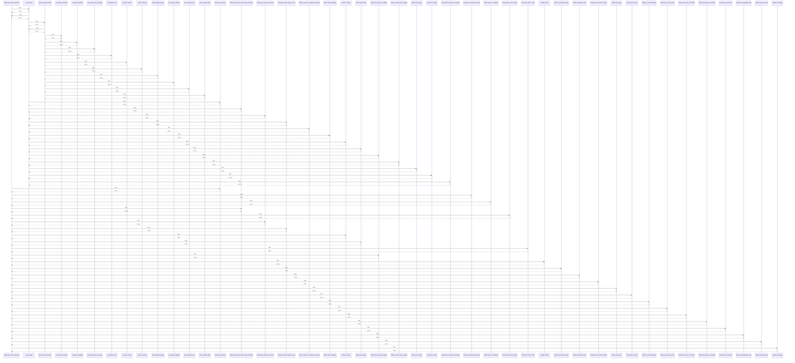

# fruitful_get_theme_options()

> God node · 27 connections · [C:\Users\hoppj\SynologyDrive\- Expertise\- Web\WordPress\Themes\Fruitful\Fruitful\inc\func\fruitful-function.php](file:///C:/Users/hoppj/SynologyDrive/-%20Expertise/-%20Web/WordPress/Themes/Fruitful/Fruitful/inc/func/fruitful-function.php#L319)

## Call Trace Diagram

## Connections by Relation

### calls
- [[.get_option()]] `INFERRED`
- [[fruitful_get_sliders()]] `INFERRED`
- [[fruitful_get_responsive_style()]] `INFERRED`
- [[fruitful_get_woo_sidebar()]] `INFERRED`
- [[fruitful_get_content_with_custom_sidebar()]] `INFERRED`
- [[fruitful_add_custom_fonts()]] `INFERRED`
- [[fruitful_get_slider_layout_flex()]] `INFERRED`
- [[fruitful_get_slider_layout_nivo()]] `INFERRED`
- [[fruitful_scripts()]] `INFERRED`
- [[fruitful_get_slider()]] `INFERRED`
- [[fruitful_get_footer_text()]] `INFERRED`
- [[fruitful_loop_shop_per_page()]] `INFERRED`
- [[.display_field()]] `INFERRED`
- [[fruitful_get_default_array()]] `EXTRACTED`
- [[fruitful_thumbnail_size()]] `INFERRED`
- [[fruitful_get_cart_button_html()]] `INFERRED`
- [[fruitful_get_logo()]] `INFERRED`
- [[fruitful_get_favicon()]] `INFERRED`
- [[fruitful_is_social_header()]] `INFERRED`
- [[fruitful_get_socials_icon()]] `INFERRED`

### contains
- [[fruitful-function.php]] `EXTRACTED`

---

*Part of the graphify knowledge wiki. See [[index]] to navigate.*