# Knowledge Graph Index

> Auto-generated by graphify. Start here — read community articles for context, then drill into god nodes for detail.

**682 nodes · 1063 edges · 135 communities**

---

## System Architecture Flowchart

```mermaid
flowchart TD
    C0["Meta Box System (87 nodes)"]
    C1["Plugin Activation (79 nodes)"]
    C2["Community 2 (74 nodes)"]
    C3["Community 3 (67 nodes)"]
    C4["Community 4 (53 nodes)"]
    C5["Community 5 (32 nodes)"]
    C6["Community 6 (30 nodes)"]
    C7["Community 7 (25 nodes)"]
    C8["Community 8 (21 nodes)"]
    C9["Community 9 (13 nodes)"]
    C10["Community 10 (11 nodes)"]
    C11["Community 11 (11 nodes)"]
    C12["Community 12 (7 nodes)"]
    C13["unknown (6 nodes)"]
    C14["Community 14 (6 nodes)"]
    C15["Community 15 (6 nodes)"]
    C16["Community 16 (6 nodes)"]
    C17["Community 17 (6 nodes)"]
    C18["unknown (5 nodes)"]
    C19["unknown (4 nodes)"]
    C20["Community 20 (4 nodes)"]
    C21["unknown (4 nodes)"]
    C22["unknown (3 nodes)"]
    C23["unknown (2 nodes)"]
    C24["unknown (2 nodes)"]
    C25["unknown (2 nodes)"]
    C26["unknown (2 nodes)"]
    C27["unknown (2 nodes)"]
    C28["unknown (2 nodes)"]
    C29["unknown (2 nodes)"]
    C30["unknown (2 nodes)"]
    C31["unknown (2 nodes)"]
    C32["unknown (2 nodes)"]
    C33["unknown (1 nodes)"]
    C34["unknown (1 nodes)"]
    C35["unknown (1 nodes)"]
    C36["unknown (1 nodes)"]
    C37["unknown (1 nodes)"]
    C38["unknown (1 nodes)"]
    C39["unknown (1 nodes)"]
    C40["unknown (1 nodes)"]
    C41["unknown (1 nodes)"]
    C42["unknown (1 nodes)"]
    C43["unknown (1 nodes)"]
    C44["unknown (1 nodes)"]
    C45["unknown (1 nodes)"]
    C46["unknown (1 nodes)"]
    C47["unknown (1 nodes)"]
    C48["unknown (1 nodes)"]
    C49["unknown (1 nodes)"]
    C50["unknown (1 nodes)"]
    C51["unknown (1 nodes)"]
    C52["unknown (1 nodes)"]
    C53["unknown (1 nodes)"]
    C54["unknown (1 nodes)"]
    C55["unknown (1 nodes)"]
    C56["unknown (1 nodes)"]
    C57["unknown (1 nodes)"]
    C58["unknown (1 nodes)"]
    C59["unknown (1 nodes)"]
    C60["unknown (1 nodes)"]
    C61["unknown (1 nodes)"]
    C62["unknown (1 nodes)"]
    C63["unknown (1 nodes)"]
    C64["unknown (1 nodes)"]
    C65["unknown (1 nodes)"]
    C66["unknown (1 nodes)"]
    C67["unknown (1 nodes)"]
    C68["unknown (1 nodes)"]
    C69["unknown (1 nodes)"]
    C70["unknown (1 nodes)"]
    C71["unknown (1 nodes)"]
    C72["unknown (1 nodes)"]
    C73["unknown (1 nodes)"]
    C74["unknown (1 nodes)"]
    C75["unknown (1 nodes)"]
    C76["unknown (1 nodes)"]
    C77["unknown (1 nodes)"]
    C78["unknown (1 nodes)"]
    C79["unknown (1 nodes)"]
    C80["unknown (1 nodes)"]
    C81["unknown (1 nodes)"]
    C82["unknown (1 nodes)"]
    C83["unknown (1 nodes)"]
    C84["unknown (1 nodes)"]
    C85["unknown (1 nodes)"]
    C86["unknown (1 nodes)"]
    C87["unknown (1 nodes)"]
    C88["unknown (1 nodes)"]
    C89["unknown (1 nodes)"]
    C90["unknown (1 nodes)"]
    C91["unknown (1 nodes)"]
    C92["unknown (1 nodes)"]
    C93["unknown (1 nodes)"]
    C94["unknown (1 nodes)"]
    C95["unknown (1 nodes)"]
    C96["unknown (1 nodes)"]
    C97["unknown (1 nodes)"]
    C98["unknown (1 nodes)"]
    C99["unknown (1 nodes)"]
    C100["unknown (1 nodes)"]
    C101["unknown (1 nodes)"]
    C102["unknown (1 nodes)"]
    C103["unknown (1 nodes)"]
    C104["unknown (1 nodes)"]
    C105["unknown (1 nodes)"]
    C106["unknown (1 nodes)"]
    C107["unknown (1 nodes)"]
    C108["unknown (1 nodes)"]
    C109["unknown (1 nodes)"]
    C110["unknown (1 nodes)"]
    C111["unknown (1 nodes)"]
    C112["unknown (1 nodes)"]
    C113["unknown (1 nodes)"]
    C114["unknown (1 nodes)"]
    C115["unknown (1 nodes)"]
    C116["unknown (1 nodes)"]
    C117["unknown (1 nodes)"]
    C118["unknown (1 nodes)"]
    C119["unknown (1 nodes)"]
    C120["unknown (1 nodes)"]
    C121["unknown (1 nodes)"]
    C122["unknown (1 nodes)"]
    C123["unknown (1 nodes)"]
    C124["unknown (1 nodes)"]
    C125["unknown (1 nodes)"]
    C126["unknown (1 nodes)"]
    C127["unknown (1 nodes)"]
    C128["unknown (1 nodes)"]
    C129["unknown (1 nodes)"]
    C130["unknown (1 nodes)"]
    C131["unknown (1 nodes)"]
    C132["unknown (1 nodes)"]
    C133["unknown (1 nodes)"]
    C134["unknown (1 nodes)"]
    C0 -->|33 edges| C4
    C6 -->|5 edges| C2
    C7 -->|5 edges| C3
    C0 -->|4 edges| C11
    C2 -->|2 edges| C6
    C9 -->|2 edges| C1
    C1 -->|2 edges| C9
    C0 -->|2 edges| C6
    C0 -->|2 edges| C3
    C3 -->|2 edges| C0
    C4 -->|2 edges| C0
    C4 -->|2 edges| C7
    C2 -->|1 edges| C12
    C1 -->|1 edges| C2
    C1 -->|1 edges| C6
    C8 -->|1 edges| C3
    C5 -->|1 edges| C7
    C0 -->|1 edges| C2
    C2 -->|1 edges| C0
    C3 -->|1 edges| C4
    C7 -->|1 edges| C8
    C7 -->|1 edges| C5
    C3 -->|1 edges| C7
    C5 -->|1 edges| C8
    C8 -->|1 edges| C5
```

## Communities
(sorted by size, largest first)

- [[Meta Box System]] — 87 nodes
- [[Plugin Activation]] — 79 nodes
- [[Community 2]] — 74 nodes
- [[Community 3]] — 67 nodes
- [[Community 4]] — 53 nodes
- [[Community 5]] — 32 nodes
- [[Community 6]] — 30 nodes
- [[Community 7]] — 25 nodes
- [[Community 8]] — 21 nodes
- [[Community 9]] — 13 nodes
- [[Community 10]] — 11 nodes
- [[Community 11]] — 11 nodes
- [[Community 12]] — 7 nodes
- [[unknown]] — 6 nodes
- [[Community 14]] — 6 nodes
- [[Community 15]] — 6 nodes
- [[Community 16]] — 6 nodes
- [[Community 17]] — 6 nodes
- [[unknown]] — 5 nodes
- [[unknown]] — 4 nodes
- [[Community 20]] — 4 nodes
- [[unknown]] — 4 nodes
- [[unknown]] — 3 nodes
- [[unknown]] — 2 nodes
- [[unknown]] — 2 nodes
- [[unknown]] — 2 nodes
- [[unknown]] — 2 nodes
- [[unknown]] — 2 nodes
- [[unknown]] — 2 nodes
- [[unknown]] — 2 nodes
- [[unknown]] — 2 nodes
- [[unknown]] — 2 nodes
- [[unknown]] — 2 nodes
- [[unknown]] — 1 nodes
- [[unknown]] — 1 nodes
- [[unknown]] — 1 nodes
- [[unknown]] — 1 nodes
- [[unknown]] — 1 nodes
- [[unknown]] — 1 nodes
- [[unknown]] — 1 nodes
- [[unknown]] — 1 nodes
- [[unknown]] — 1 nodes
- [[unknown]] — 1 nodes
- [[unknown]] — 1 nodes
- [[unknown]] — 1 nodes
- [[unknown]] — 1 nodes
- [[unknown]] — 1 nodes
- [[unknown]] — 1 nodes
- [[unknown]] — 1 nodes
- [[unknown]] — 1 nodes
- [[unknown]] — 1 nodes
- [[unknown]] — 1 nodes
- [[unknown]] — 1 nodes
- [[unknown]] — 1 nodes
- [[unknown]] — 1 nodes
- [[unknown]] — 1 nodes
- [[unknown]] — 1 nodes
- [[unknown]] — 1 nodes
- [[unknown]] — 1 nodes
- [[unknown]] — 1 nodes
- [[unknown]] — 1 nodes
- [[unknown]] — 1 nodes
- [[unknown]] — 1 nodes
- [[unknown]] — 1 nodes
- [[unknown]] — 1 nodes
- [[unknown]] — 1 nodes
- [[unknown]] — 1 nodes
- [[unknown]] — 1 nodes
- [[unknown]] — 1 nodes
- [[unknown]] — 1 nodes
- [[unknown]] — 1 nodes
- [[unknown]] — 1 nodes
- [[unknown]] — 1 nodes
- [[unknown]] — 1 nodes
- [[unknown]] — 1 nodes
- [[unknown]] — 1 nodes
- [[unknown]] — 1 nodes
- [[unknown]] — 1 nodes
- [[unknown]] — 1 nodes
- [[unknown]] — 1 nodes
- [[unknown]] — 1 nodes
- [[unknown]] — 1 nodes
- [[unknown]] — 1 nodes
- [[unknown]] — 1 nodes
- [[unknown]] — 1 nodes
- [[unknown]] — 1 nodes
- [[unknown]] — 1 nodes
- [[unknown]] — 1 nodes
- [[unknown]] — 1 nodes
- [[unknown]] — 1 nodes
- [[unknown]] — 1 nodes
- [[unknown]] — 1 nodes
- [[unknown]] — 1 nodes
- [[unknown]] — 1 nodes
- [[unknown]] — 1 nodes
- [[unknown]] — 1 nodes
- [[unknown]] — 1 nodes
- [[unknown]] — 1 nodes
- [[unknown]] — 1 nodes
- [[unknown]] — 1 nodes
- [[unknown]] — 1 nodes
- [[unknown]] — 1 nodes
- [[unknown]] — 1 nodes
- [[unknown]] — 1 nodes
- [[unknown]] — 1 nodes
- [[unknown]] — 1 nodes
- [[unknown]] — 1 nodes
- [[unknown]] — 1 nodes
- [[unknown]] — 1 nodes
- [[unknown]] — 1 nodes
- [[unknown]] — 1 nodes
- [[unknown]] — 1 nodes
- [[unknown]] — 1 nodes
- [[unknown]] — 1 nodes
- [[unknown]] — 1 nodes
- [[unknown]] — 1 nodes
- [[unknown]] — 1 nodes
- [[unknown]] — 1 nodes
- [[unknown]] — 1 nodes
- [[unknown]] — 1 nodes
- [[unknown]] — 1 nodes
- [[unknown]] — 1 nodes
- [[unknown]] — 1 nodes
- [[unknown]] — 1 nodes
- [[unknown]] — 1 nodes
- [[unknown]] — 1 nodes
- [[unknown]] — 1 nodes
- [[unknown]] — 1 nodes
- [[unknown]] — 1 nodes
- [[unknown]] — 1 nodes
- [[unknown]] — 1 nodes
- [[unknown]] — 1 nodes
- [[unknown]] — 1 nodes
- [[unknown]] — 1 nodes
- [[unknown]] — 1 nodes

## God Nodes
(most connected concepts — the load-bearing abstractions)

- [[cmb_Meta_Box]] — 54 connections
- [[TGM_Plugin_Activation]] — 53 connections
- [[cmb_Meta_Box_types]] — 53 connections
- [[fruitful_get_theme_options()]] — 27 connections
- [[TGMPA_List_Table]] — 27 connections
- [[cmb_Meta_Box_field]] — 22 connections
- [[cmb_Meta_Box_Sanitize]] — 17 connections
- [[fruitful_theme_options]] — 11 connections
- [[A()]] — 11 connections
- [[fruitfulcFormInlineErrors]] — 9 connections

---

*Generated by [graphify](https://github.com/safishamsi/graphify)*